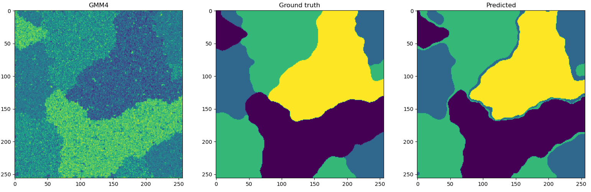

# implementation of "Fast Unsupervised Bayesian Image Segmentation With Adaptive Spatial Regularisation" (Marcelo Pereyra and Steve McLaughlin)

## Getting started

Run the following command to install the dependecies:

```
pip install -r requirements.txt
```

For examples of usage please refer to the ```segmentation.py``` script.

## Results

| Implementation/Image | GMM4  | GMM8  | LMM2  | PMM3  |
| --------- | ----- | ----- | ----- | ----- |
| Paper     | 88.9% | 89.6% | 96.0% | 93.1% |
| Mine      | 95.6% | 87.8% | 93.3% | 96.5% |




